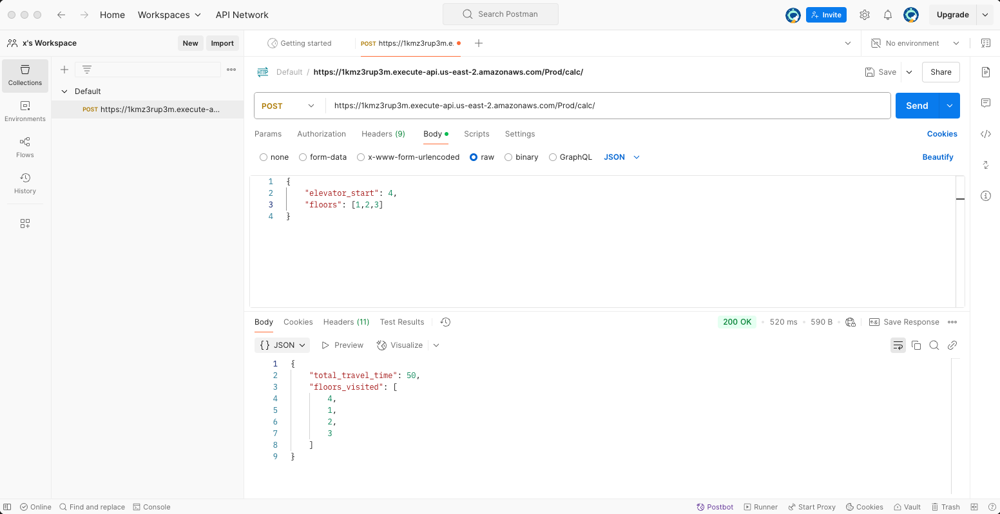
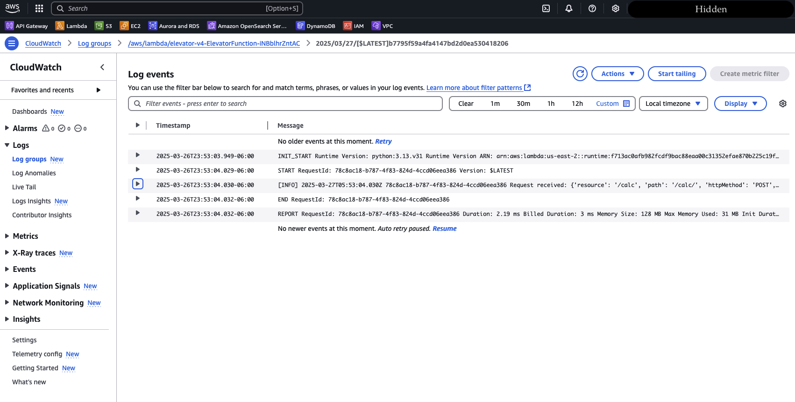
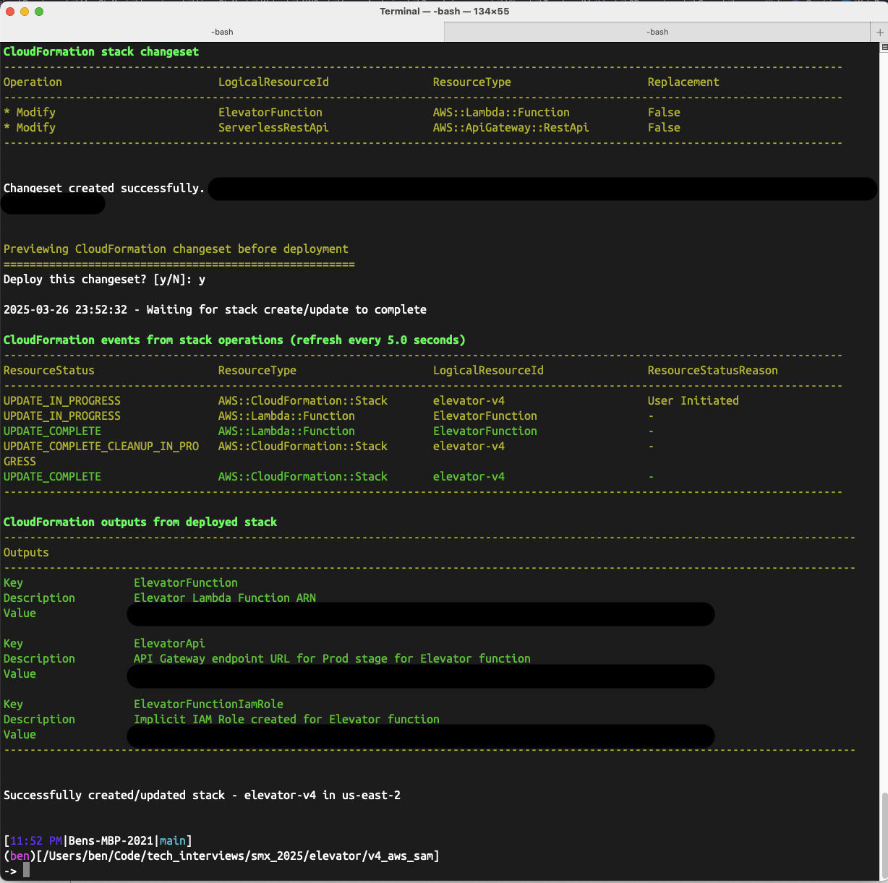

# Elevator Project

An elevator sim for a job interview.


## Instructions Provided

Before interviewing we have all candidates complete an Elevator Project. Please see details and review the instructions below and complete the project accordingly.

* Provide code that simulates an elevator. You are free to use any language.

* Upload the completed project to GitHub (public) for discussion during interview.

* Document all assumptions and any features that weren’t implemented.

* The result should be an executable, or script, that can be run with the following inputs and generate the following outputs.

  ```
  Inputs: [list of floors to visit] (e.g. elevator start=12 floor=2,9,1,32)

  Outputs: [total travel time, floors visited in order] (e.g. 560 12,2,9,1,32)

  Program Constants: Single floor travel time: 10
  ```

Submission Instructions:

Once your project is complete, please upload it to GitHub and send me the link at least 48 business hours prior to your scheduled interview. This will allow the team enough time to review your project prior to the interview.


## Assumptions
Based on the provided instructions, it looks like a very simple project / script.

The inputs and outputs are a little vague (Should the input be one single list or an int and a list? Should the output be a single list or two separate items?) but I assume that this is to give the candidate a bit of flexibility in how they approach the assignment.

I also assume that since those are the only inputs and outputs requested, that is the only functionality that is being asked to be simulated.

I went back-and-forth a bit trying to decide how much time and effort to put into this. On one hand, I feel like the assignment can be solved pretty easily with a couple lines in a bash script, but since the interview is scheduled for an hour, I don't know how much there would be to actually talk about or how much that would showcase my talents or problem-solving abilities.

On the other hand, maybe the assignment is meant to be easy, and the interview is meant to see if I'm just doing the bare minimum or whether I actually put a little time and effort to making something worth talking about for more than 30 seconds? Should I build an entire web application from scratch, model the elevator and a 100 story building in Fusion, import some physics libraries, deploy the whole thing using CI/CD pipelines, and allow floor inputs via a realistic looking elevator panel?

So I went with a bit of a middle ground approach and created a couple different smaller options that I hope satisfy the intent of the assignement while still allowing me to sleep and spend some time with my family over the weekend.

## The actual code

__elevator_v1__ <br>
This is just a basic python script that can be run from the terminal. It uses the native `argparse` module
to accept and parse inputs. No input validation outside of that which is included with `argparse`. Output is just printed to the screen.

To run the script:

`python elevator.py -s <starting_floor> -f <list of floors to visit>`

Example:

`python elevator.py -s 12 -f 32 14 7 99`

<br>


__elevator_v2__ <br>
An Elevator class, with some brief input validation during class instantiation, defined within it's own module so that it can be imported. All inputs and calculations are done during instantiation and getter methods are used to retrieve the values.

I created a test script `run_tests.py` that is designed to run against the elevator module and test for valid inputs and ensure calculations are correct.

To run the test script:

`python run_tests.py -v`

<br>


__elevator_v3__ <br>
I started working on this at like 10pm Monday night. The plan was to do a bit of brainstorming, go into a bit more depth, maybe flesh out the idea and put some more thought and effort into it, but it started to look less like an elevator sim and more like elevator software so I abandoned that approach.

<br>


__elevator_v4__ <br>
V4 is a work in progress. Since the role I applied for is a full stack / web dev position, I figured I might try to get something quick and dirty deployed. Since I deleted my old AWS account last year (because I was burning money on databases I wasn't actively using) I created a new AWS account (root level), created an IAM account for dev work, installed `aws-sam-cli`, spun up a quick hello-world app, and got it deployed.

POST Endpoint here: https://1kmz3rup3m.execute-api.us-east-2.amazonaws.com/Prod/calc/

As of 1:18am on Wednesday morning, all it does it return 'hello world', but since the assignment is due Wednesday morning (to give the team 48hrs to review), that's where I'm going to leave it for now. If I get time before Friday, I may update it to accept the elevator start and list of floors to visit in JSON format and return the travel time info. If I have a bunch of extra time, I may try to throw a very basic front-end on it all, but that is unlikely.

___UPDATE 12:02am 3/27___ <br>
So I managed to add some more functionality and deployed the changes. The lambda now will handle http requests, calculate the `total_travel_time` and `floors_visited`. I also included some basic logging in the lambda, which can be viewed through CloudWatch (see screenshots below). I also added a very basic test script that allows local testing without having to deploy to dev/prod. I tested with Postman (see screenshots below). I also included a screenshot of the changes being deployed below.

## Summary
I hope I met the spirit / intent of the assignment and hopefully we have something to talk about during the interview on Friday. Thanks for taking the time to read this and I look forward to talking to you soon!

## Screenshots
Postman - Successful POST request
 <br>

AWS CloudWatch Lambda Logs


SAM CLI redeployment



